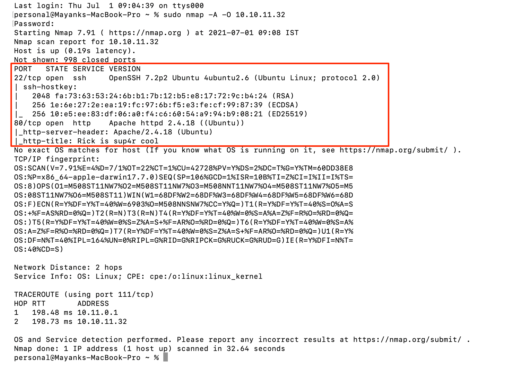
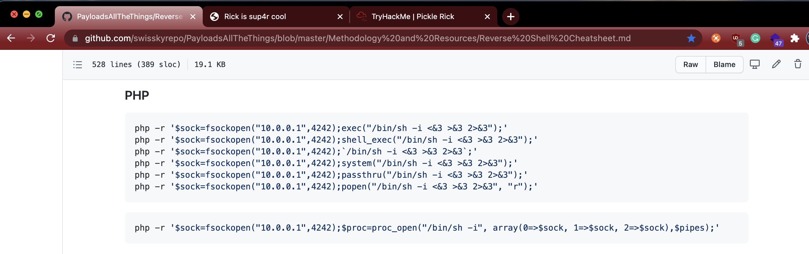

# Pickle Rick THM Writeup

Today I am going to solve my first challenge "Pickle Rick". It is available in TryHackMe for penetration testing practice. The challenge level is easy. Let's start by booting up the target machine in the tryhackme page. U can find the link for the room [here](https://tryhackme.com/room/picklerick). After boot up, tryhackme will assign an ip address to the machine and it will be visible on that page as well. 

**IP Address: 10.10.11.32** 
(*Note: IP in this scan will probably be different then what you have*)

## Network Scan

The first thing I did after getting the IP address was to run the nmap tool to see which ports are opened 
`sudo nmap -O -A 10.10.11.32`

Now u must be thinking why did i used sudo. Well, let's do it without sudo first and see what I get

We need sudo to do OS scan.

So now let's look at the nmap results

Great. We have SSH and HTTP open. 

## Enumeration

Since we don't have SSH credentials, so i am going to start with HTTP and do a gobuster scan
`gobuster dir -w Desktop/directory-list-2.3-small.txt -t 50 -u http://10.10.11.32 -x txt,php,html -z`

I know I used the small list. 
Now this list is present in kali by default in the folder <mark>*/usr/share/dirbuster/wordlists/*<mark>

Since I am using mac os so I had to download the file from the [link](https://raw.githubusercontent.com/daviddias/node-dirbuster/master/lists/directory-list-2.3-small.txt)
	
While I am waiting for the gobuster scan to complete I figured I can take a look around and see if i can find anything useful in the meantime. I navigated to the websites homepage and checked it's source code. Ahh we found a note at the end and it has a username in it 

	
We can use the username which we got earlier and password from the hint we got in robots.txt. 

	
Well I got in at the first try. Lucky me. Now I am welcomed with this beautiful command panel.

	

## Exploitation

Now i will try `ls` command (my favourite) and we see **Sup3rS3cretPickl3Ingred.txt** file

Great. Let's do cat and see what are the contents of this file. Ohh no <u>command disabled</u>

Now let's try to do a get a reverse shell to find out the files in this server. Since this is a php page, let's try the reverse shell payload from [PayloadAllTheThings github repo](https://github.com/swisskyrepo/PayloadsAllTheThings/blob/master/Methodology%20and%20Resources/Reverse%20Shell%20Cheatsheet.md)

	
I used the last payload and replaced my tunnel IP address and port as 8080 *(Any port can be used. It's just 8080 is my personal preference)*. I am also starting the netcat listener to listen to port 8080 in the command prompt to receive the shell

	
Once I execute the payload, the screen is stuck in loading. Now let's look at the command prompt to confirm whether we got the shell or not 

Great. We have the reverse shell now. Now let's try to run some commands

Now we know we are *www-data* user and we can see the *Sup3rS3cretPickl3Ingred.txt* file which we have to read.
	
Let's read the file with cat command.

Wow. We have our first flag 
	
Now let's explore further

We got the second flag in the directory /home/rick

## Priviledge Escalation

Now let's see if we have the root permission to explore further

Once we know that we can run the sudo command with no restriction we started the bash to get the root access. That’s it! We got the last flag.
	
I hope you enjoyed this write up. I will continue to write more walkthroughs like this in the future. 
